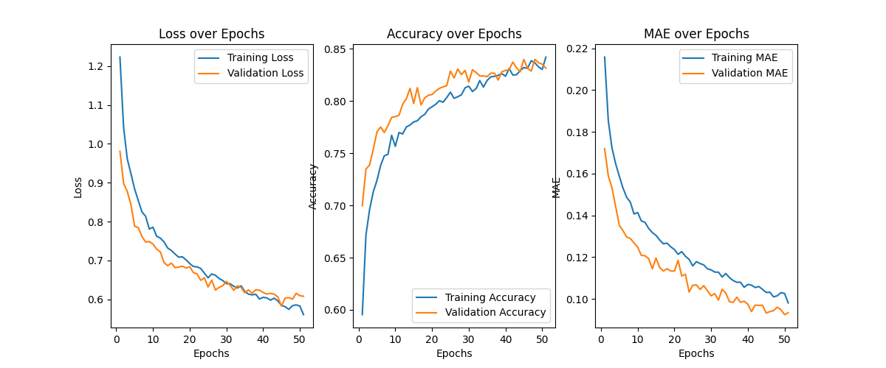

# ONIA

Repositório destinado a guardar os modelos de IA utilizados na ONIA (Olimpíada Nacional de Inteligência Artificial).
Os arquivos csv não estão disponibilizados.

Gráficos do melhor modelo obtido:

F-Score weighted: 0.872

A arquitetura do modelo se encontra no arquivo [model.py](model.py)
