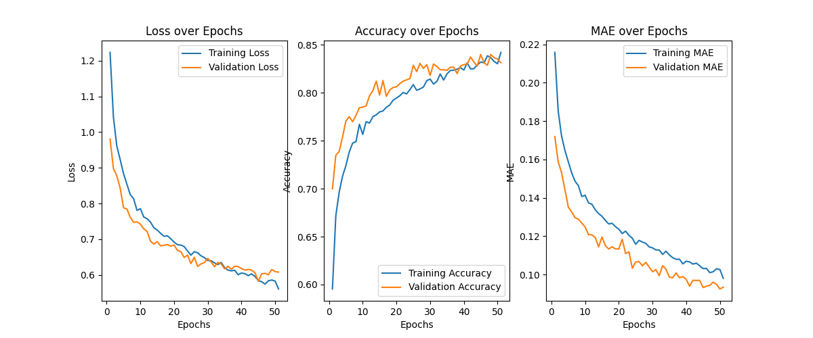

# ONIA - 3 fase 2025

Essa foi minha solução final para o problema de classificação de planetas da terceira fase da ONIA 2025.

Gráficos do melhor modelo obtido:

F-Score weighted (test set): 0.872
F-Score weighted (eval set): ~0.8
Classificação final: ~20/270
