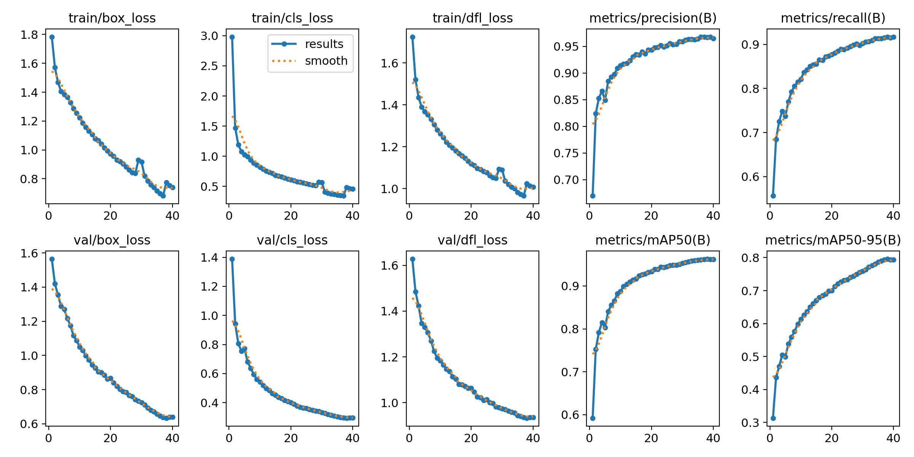
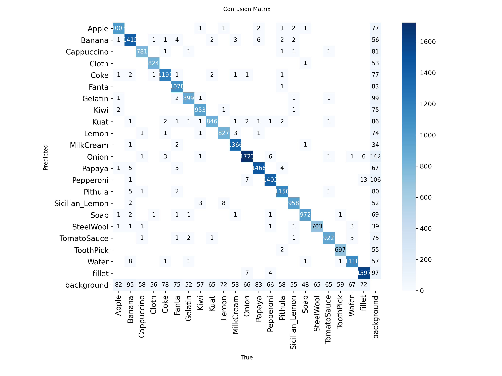
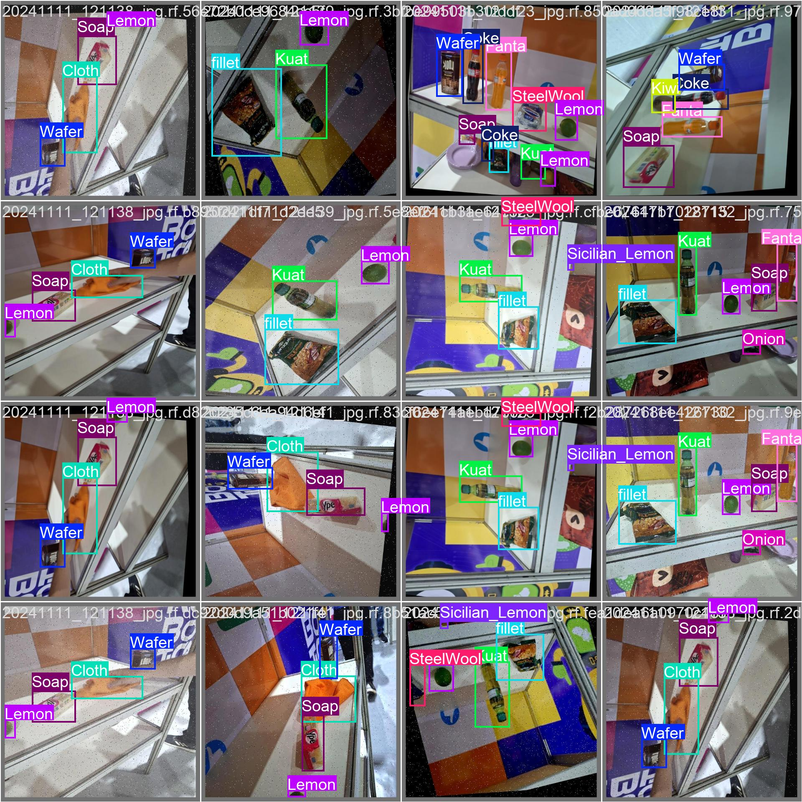
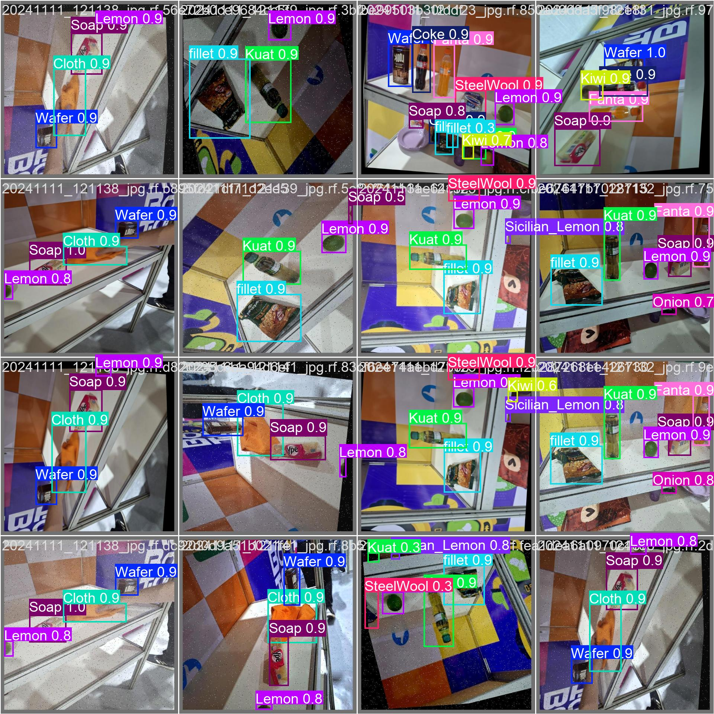

# ONIA - 4a fase 2025

Essa foi minha entrega para a última prova da última fase da ONIA 2025 (seletiva para a IOAI).

A tarefa foi fazer o fine-tuning de um modelo YOLO para a detecção de objetos variados em um cenário de robótica competitiva.
O dataset já vinha com augmentation (o que causou data leakage entre o set de teste e validação), com uma quantidade moderada de dados (26k imagens 640x640).

## Ambiente
Cluster HPC Sdumont2nd; acesso a runtimes com 1xH100; limite de 20 minutos por job.

A prova foi feita do 0 em um período de 5h. Incluído neste tempo está o preparo do ambiente, escolha de modelo, loading dos dados, o trainemento e a estruturação da entrega (relatório + inference.py + inference.srm).

## Metadata

- Argumentos de treinamento utilizados [args.yaml](/results/args.yaml):
  - Modelo base: Yolo v8
  - Otimizador: SGD + 0.9 momentum
  - LR: decay linear; lr0 = 0.005, lrf = 0.01, warmup = 5, warmup_momentum = 0.8, warmup_bias_lr = 0.1
  - weight_decay: 0.0005
  - batch size: 64
  - Data Augmentation:
    - Mosaic: 100% (apenas nos 30 primeiros epochs)
    - CopyPaste e Mixup: 10%
    - scale: 50%, fliplr: 50%, translate: 10%
    - hsv_h: 1,5%, hsv_s: 70%, hsv_v: 40%

# Resultados

Métricas

Qualidade de classificação

Exemplos
<table border="0">
<tr>
<td width="50%"><b align="center">Labels</b></td>
<td width="50%"><b align="center">Predições</b></td>
</tr>
<tr>
<td></td>
<td></td>
</tr>
</table>

# Análise do problema e da solução
Enquanto o problema em geral é relativamente simples (apenas fine-tuning de um Yolo), a condição dos dados e limitações do ambiente copmlicaram alguns passos.

O primeiro desafio é a condição dos dados. Enquanto a quanitdade de imagens é OK (26 mil), *todas* elas já contam com data augmentation.
Isso implica duas coisas:
1. O dataset real provavelmente tem no máx ~5k imagens, que inflaram para 26k com a augmentation.
2. Não importa o split que seja feito, haverá data leakage. Como as imagens já tem augmentation, não dá para diferenciar a imagem A da imagem A' com augmentation e colocá-las no mesmo split.

E o segundo desafio é a limitação de 20 minutos no cluster. Enquanto uma H100 é mais que suficiente pra fazer fine-tning de um Yolo, a duração máxima de 20 minutos obriga o uso de checkpointing, e complica um pouco a pipeline de treinamento/tunagem de hiperparâmetros.

Com isso em mente, meu plano foi:
1. Não me preocupar com o data leakage. Separar as imagens com augmentation pra não ter data leakage seria um trampo absurdo sem garantia de retorno, e um modelo de detecção de objetos tende a ser menos sensível a esse tipo de data lakage, já que ele exige a regressão de coordenadas. Mesmo que a semântica da imagem seja repetida, o modelo ainda precisa aprender a precisão espacial da localização, o que mitiga parte do efeito de memorização pura comum em classificadores.
2. Ser cuidadoso com a LR para evitar overfitting sem me apoiar totalmente no train/test split.
3. Usar o máximo de tempo possível para experimentar com parâmetros diferentes, até achar algo bom o suficiente.

## Escolha de modelos e parâmetros
O modelo que eu escolhi para fazer essa prova foi o Yolo v8. A tarefa de detecção aqui não é extremamente complexa, e usar um modelo um pouquinho menor me ajudou a ganhar tempo na experimentação com hiperparâmetros, além de diminuir o risco durante o treinamento.

Para escolher os hiperparâmetros, comecei com o otimizador Adam pra iterar mais rápido e ir vendo como o modelo estava se comportando. Quando estava com uma baseline OK, parti para o SGD com momentum, que costuma dar resultados melhores para CV em geral.
A escolha da maioria deles não foi extremamente racional; foi um conjunto de teste com intuição, uma vez que os modelos estavam convergindo bem. No final das contas, os hiperparâmetros do otimizador e LR ficaram como é de se esperar para um fine-tuning médio em um Yolo.

Sobre as augmentations, no entanto, eu fui mais estratégico. Quando estava olhando as imagens fonte, percebi algumas coisas. Primeiramente, vi que quase não havia augmentation de cor/saturação/exposição. Além disso, também percebi que haviam algumas imagens com objetos bem pequenos.
Com isso, decidi fazer três coisas principais nas augmentations:
1. Utilizei bastante augmentation de cor/saturação/etc, já que isso era algo que estava faltando um pouco no dataset original.
2. Utilizei o Mosaic (que combina várias imagens em uma só) em 100% das imagens dos primeiros 30 de 40 epochs. Isso para forçar o modelo a ficar bom nos objetos menores, que são mais difíceis e bastante comuns no dataset.
3. Utilizei pouca augmentation de giro/skew/etc, que eram augmentations que já haviam sido um pouco feitas nas imagens-fonte. 

### Problemas com o inference.py

Na prova, também tive que escrever o código do inference.py, que, francamente, foi um bom desafio pra mim. No enunciado da prova, eles pediam, entre outras métricas, a ClassAccuracy do modelo final. 

No entanto, diferentemente de em problemas de classificação de imagem, não existe uma métrica exata para a acurácia das classes preditas, pois não dá para detectar verdadeiros negativos em um modelo de detecção de objetos adequadamente.
Por isso, geralmente se usa o F1 score, já que ele é calculado sem a quantidade de verdadeiros negativos.

No calor do momento, eu não tinha percebido isso. Fiquei uns 20 minutos pesquisando a documentação inteira do ultralytics, perguntando pra todas as LLMs e não achava a tal da ClassAccuracy (que não existe). Faltando alguns segundos pra entrega da prova, decidi só tacar o F1 score, e entreguei sem nem testar se tava rodando certo. No fim, o F1 provavelmente era a métrica mais justa/adequada para essa avaliação, e acho que é o que acabaram usando pras classificações finais.

### Conclusão

No final, consegui treinar um modelo bom o suficiente em 40 epochs, mesmo sem ter o split de teste/treino adequado. 

<small>Detalhe: Acabei fazendo algumas modificações de última hora nos hiperparâmetros dele, e por isso algumas coisas que eu escrevi no relatório não batem com os parâmetros finais do modelo.</small>

